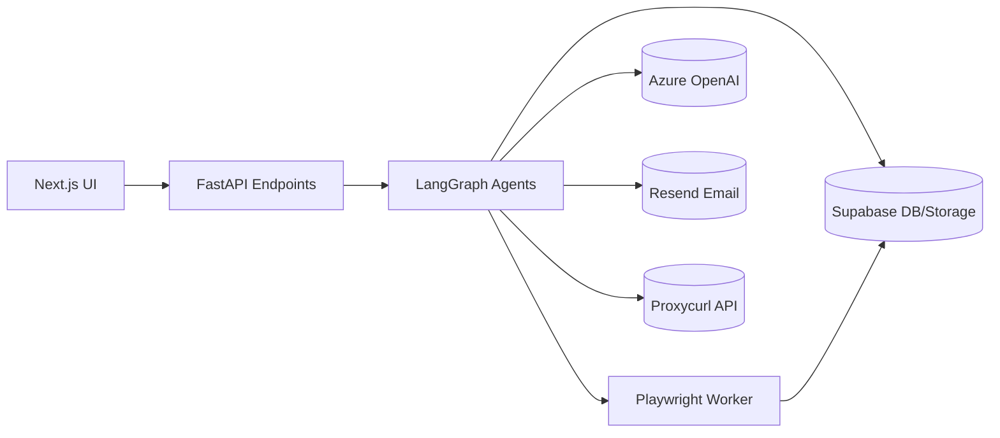

# High-Level Architecture (Monolith-First)

## System Overview



## Why Monolith-First Approach?

1. **Development Velocity**: Single repository, single CI/CD pipeline, faster iteration cycle
2. **Simplified Deployment**: Easier to deploy and manage for a weekend MVP project
3. **Security Surface**: Single codebase means a consolidated threat surface for security review
4. **Clear Module Boundaries**: Enforces good module separation while keeping microservices as a future option
5. **Reduced Operational Complexity**: Fewer moving parts to monitor and maintain

## Component Descriptions

### Frontend (Next.js)

The frontend is built with Next.js using React and TypeScript, providing a responsive and modern UI for users to:

- Search for jobs by keyword and filters
- View recruiter profiles and job information
- Edit and send personalized outreach messages
- Track outreach results

Key components include:

- `SearchForm` - For job search criteria input
- `RecruiterCard` - For displaying recruiter information
- `MarkdownEditor` - For editing outreach templates
- `API` wrapper - For communicating with backend services

### Backend (FastAPI)

The backend provides a REST API that:

- Handles user authentication via Supabase
- Orchestrates the AI agent workflow
- Manages data storage and retrieval
- Communicates with external services

The core of the backend is built around FastAPI for:

- Asynchronous request handling
- Automatic API documentation
- Type validation and schema enforcement
- Efficient performance with minimal overhead

### LangGraph Agents

The agent system uses LangGraph to create a directed acyclic graph (DAG) of AI agents:

```python
with Graph() as g:
    jobs = g.add(JobSearchAgent)
    recs = g.add(RecruiterAgent).after(jobs)
    note = g.add(PersonaliseAgent).after(recs)
    g.set_entry_point(jobs)
```

Each agent has specific responsibilities:

1. **JobSearchAgent**: Searches LinkedIn for matching job listings
2. **RecruiterAgent**: Extracts recruiter information from job listings
3. **PersonaliseAgent**: Generates personalized outreach based on context

### Playwright Worker

The Playwright MCP (Model Context Protocol) worker:

- Runs in a separate process to handle browser automation
- Uses headful mode to mimic human interaction
- Implements rate limiting and anti-detection measures
- Captures PDF versions of recruiter profiles
- Uploads captures to Supabase Storage

### External Services

The system integrates with external services:

- **Supabase**: For authentication, database, and file storage
- **Azure OpenAI**: For primary LLM functionality (o4-mini)
- **Local Llama**: For offline fallback LLM capability
- **Proxycurl**: For email address discovery
- **Resend**: For email delivery with tracking

## Data Flow

1. User inputs search criteria in the UI
2. Frontend sends search request to FastAPI backend
3. Backend triggers JobSearchAgent to find relevant job listings
4. Job URLs are passed to RecruiterAgent
5. RecruiterAgent uses Playwright to:
    - Visit job pages
    - Identify recruiters
    - Capture profiles as PDFs
    - Store profiles in Supabase
6. Retrieved recruiter information is processed by PersonaliseAgent
7. Personalized outreach drafts are stored in Supabase
8. Frontend displays drafts for user review and sends via Resend

## Error Handling & Fallbacks

The system implements several fallback mechanisms:

- LinkedIn rate limiting: Exponential backoff (5s → 30s → 60s)
- No recruiter found: Visit company page → "People" tab → filter "Recruiter"
- Proxycurl quota exhausted: Use MX record hunting to guess email formats

## Security Architecture

Security considerations are implemented at multiple levels:

- **Authentication**: Supabase handles user auth with secure practices
- **Data Access**: Row-level security ensures users only access their own data
- **API Protection**: Rate limiting and input validation prevent abuse
- **Credentials**: LinkedIn cookies remain on client-side only
- **External Services**: All API calls use HTTPS with proper authentication

For detailed security information, see [[Security]]

## Future Architectural Considerations

While the monolith approach is ideal for the MVP, the design allows for future evolution:

- Splitting into microservices if needed for scale
- Moving Playwright worker to serverless functions
- Adding a queue system for job processing
- Implementing a dedicated analytics service