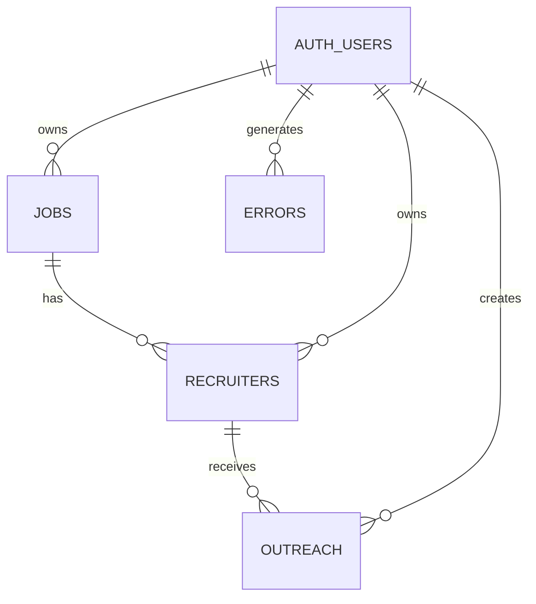

# Supabase Schema (SQL)

This document details the database schema used in the LinkedIn Recruiter Outreach application. The schema is implemented in Supabase (PostgreSQL) with row-level security policies to protect user data.

## Core Tables

The database consists of three primary tables:

- `jobs`: Stores information about job postings
- `recruiters`: Stores information about recruiters linked to jobs
- `outreach`: Stores personalized outreach messages

## SQL Schema Definition

```sql
-- Enable necessary extensions
CREATE EXTENSION IF NOT EXISTS "uuid-ossp";

-- Jobs table
CREATE TABLE jobs (
  id BIGINT PRIMARY KEY,
  title TEXT NOT NULL,
  company TEXT NOT NULL,
  location TEXT,
  url TEXT NOT NULL,
  date_found TIMESTAMPTZ DEFAULT now(),
  user_id UUID REFERENCES auth.users(id) NOT NULL
);

-- Recruiters table
CREATE TABLE recruiters (
  id TEXT PRIMARY KEY,
  name TEXT NOT NULL,
  profile_url TEXT NOT NULL,
  email TEXT,
  pdf_path TEXT,
  job_id BIGINT REFERENCES jobs(id) NOT NULL,
  user_id UUID REFERENCES auth.users(id) NOT NULL
);

-- Outreach table
CREATE TABLE outreach (
  id UUID PRIMARY KEY DEFAULT gen_random_uuid(),
  recruiter_id TEXT REFERENCES recruiters(id) NOT NULL,
  subject TEXT NOT NULL,
  body_md TEXT NOT NULL,
  status TEXT CHECK (status IN ('draft', 'sent', 'replied')) DEFAULT 'draft',
  sent_at TIMESTAMPTZ,
  user_id UUID REFERENCES auth.users(id) NOT NULL
);

-- Error logging table
CREATE TABLE errors (
  id UUID PRIMARY KEY DEFAULT gen_random_uuid(),
  user_id UUID REFERENCES auth.users(id) NOT NULL,
  type TEXT NOT NULL,
  context JSONB,
  timestamp TIMESTAMPTZ DEFAULT now()
);
```

## Table Relationships



## Row-Level Security Policies

Row-level security (RLS) policies ensure that users can only access their own data.

```sql
-- Enable RLS on all tables
ALTER TABLE jobs ENABLE ROW LEVEL SECURITY;
ALTER TABLE recruiters ENABLE ROW LEVEL SECURITY;
ALTER TABLE outreach ENABLE ROW LEVEL SECURITY;
ALTER TABLE errors ENABLE ROW LEVEL SECURITY;

-- Jobs table policies
CREATE POLICY "Users can select their own jobs"
  ON jobs FOR SELECT
  USING (auth.uid() = user_id);
  
CREATE POLICY "Users can insert their own jobs"
  ON jobs FOR INSERT
  WITH CHECK (auth.uid() = user_id);
  
CREATE POLICY "Users can update their own jobs"
  ON jobs FOR UPDATE
  USING (auth.uid() = user_id);
  
CREATE POLICY "Users can delete their own jobs"
  ON jobs FOR DELETE
  USING (auth.uid() = user_id);

-- Recruiters table policies
CREATE POLICY "Users can select their own recruiters"
  ON recruiters FOR SELECT
  USING (auth.uid() = user_id);
  
CREATE POLICY "Users can insert their own recruiters"
  ON recruiters FOR INSERT
  WITH CHECK (auth.uid() = user_id);
  
CREATE POLICY "Users can update their own recruiters"
  ON recruiters FOR UPDATE
  USING (auth.uid() = user_id);
  
CREATE POLICY "Users can delete their own recruiters"
  ON recruiters FOR DELETE
  USING (auth.uid() = user_id);

-- Outreach table policies
CREATE POLICY "Users can select their own outreach"
  ON outreach FOR SELECT
  USING (auth.uid() = user_id);
  
CREATE POLICY "Users can insert their own outreach"
  ON outreach FOR INSERT
  WITH CHECK (auth.uid() = user_id);
  
CREATE POLICY "Users can update their own outreach"
  ON outreach FOR UPDATE
  USING (auth.uid() = user_id);
  
CREATE POLICY "Users can delete their own outreach"
  ON outreach FOR DELETE
  USING (auth.uid() = user_id);

-- Errors table policies
CREATE POLICY "Users can select their own errors"
  ON errors FOR SELECT
  USING (auth.uid() = user_id);
  
CREATE POLICY "Users can insert their own errors"
  ON errors FOR INSERT
  WITH CHECK (auth.uid() = user_id);
```

## Indexes

Indexes are created to optimize query performance:

```sql
-- Jobs table indexes
CREATE INDEX idx_jobs_user_id ON jobs(user_id);
CREATE INDEX idx_jobs_company ON jobs(company);
CREATE INDEX idx_jobs_date_found ON jobs(date_found);

-- Recruiters table indexes
CREATE INDEX idx_recruiters_user_id ON recruiters(user_id);
CREATE INDEX idx_recruiters_job_id ON recruiters(job_id);

-- Outreach table indexes
CREATE INDEX idx_outreach_user_id ON outreach(user_id);
CREATE INDEX idx_outreach_recruiter_id ON outreach(recruiter_id);
CREATE INDEX idx_outreach_status ON outreach(status);

-- Errors table indexes
CREATE INDEX idx_errors_user_id ON errors(user_id);
CREATE INDEX idx_errors_type ON errors(type);
CREATE INDEX idx_errors_timestamp ON errors(timestamp);
```

## Table Details

### Jobs Table

Stores information about LinkedIn job postings.

|Column|Type|Description|
|---|---|---|
|id|BIGINT|Primary key, LinkedIn job ID|
|title|TEXT|Job title|
|company|TEXT|Company name|
|location|TEXT|Job location|
|url|TEXT|LinkedIn job URL|
|date_found|TIMESTAMPTZ|When the job was found|
|user_id|UUID|User who found/owns this job|

### Recruiters Table

Stores information about recruiters associated with jobs.

|Column|Type|Description|
|---|---|---|
|id|TEXT|Primary key, LinkedIn profile ID|
|name|TEXT|Recruiter's name|
|profile_url|TEXT|LinkedIn profile URL|
|email|TEXT|Email address (if found)|
|pdf_path|TEXT|Path to stored PDF profile|
|job_id|BIGINT|Associated job ID|
|user_id|UUID|User who found/owns this recruiter|

### Outreach Table

Stores personalized outreach messages to recruiters.

|Column|Type|Description|
|---|---|---|
|id|UUID|Primary key|
|recruiter_id|TEXT|Recruiter receiving the outreach|
|subject|TEXT|Email subject line|
|body_md|TEXT|Email body in Markdown format|
|status|TEXT|Status: 'draft', 'sent', or 'replied'|
|sent_at|TIMESTAMPTZ|When the outreach was sent|
|user_id|UUID|User who created this outreach|

### Errors Table

Logs errors and potential security events.

|Column|Type|Description|
|---|---|---|
|id|UUID|Primary key|
|user_id|UUID|User who experienced the error|
|type|TEXT|Error type (e.g., 'rate_limit', 'api_error')|
|context|JSONB|Additional error context as JSON|
|timestamp|TIMESTAMPTZ|When the error occurred|

## Storage Configuration

In addition to the database tables, Supabase Storage is used to store PDF profiles:

```sql
-- Create a storage bucket for profiles
INSERT INTO storage.buckets (id, name) 
VALUES ('profiles', 'Recruiter Profiles');

-- Set up storage policies
CREATE POLICY "Users can upload their own profiles"
  ON storage.objects FOR INSERT
  WITH CHECK (bucket_id = 'profiles' AND auth.uid() = owner);
  
CREATE POLICY "Users can view their own profiles"
  ON storage.objects FOR SELECT
  USING (bucket_id = 'profiles' AND auth.uid() = owner);
  
CREATE POLICY "Users can delete their own profiles"
  ON storage.objects FOR DELETE
  USING (bucket_id = 'profiles' AND auth.uid() = owner);
```

## Database Migrations

Migrations are managed through SQL files in the `supabase/migrations` directory:

```
supabase/migrations/
├─ 20250401000000_initial_schema.sql   # Base schema
├─ 20250401000001_storage_setup.sql    # Storage configuration
├─ 20250401000002_indexes.sql          # Index creation
└─ 20250401000003_rls_policies.sql     # RLS policy creation
```

## Local Development

To set up the database locally:

```bash
# Initialize Supabase
supabase init

# Reset the database with the current schema
supabase db reset
```

## Production Considerations

In production, backups are automatically managed by Supabase. Additional considerations include:

1. **Monitoring**: Set up alerts for high error counts
2. **Data Retention**: Implement policies for old data cleanup
3. **Scaling**: Monitor query performance and adjust indexes as needed