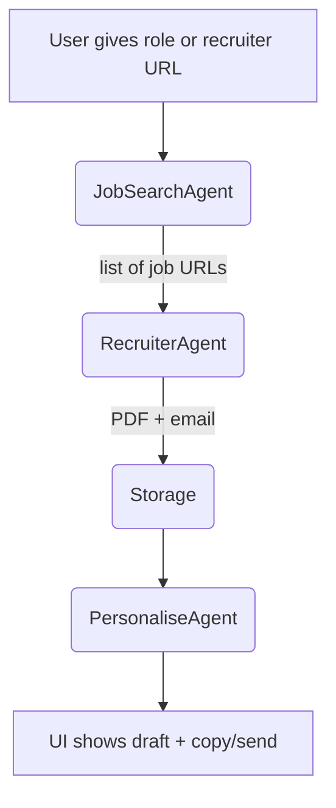

# Product Requirements Document — v0.3

## 1 · Objective

Help serious job seekers create direct, personalised connections to the human behind a LinkedIn posting, without paying for Premium tools or risking account bans.

## 2 · Personas

|Persona|Key Traits|Pain|
|---|---|---|
|**Focused Optimizer (Alex)**|2-5 yrs exp, values efficiency|Filling 30 ATS forms/week, zero responses.|
|**Career-Switcher (Bri)**|Non-traditional background|Needs personal story to stand out.|
|**New Grad (Chen)**|First job hunt|Wants feedback loop on outreach.|

## 3 · Success Metrics (MVP private beta)

|KPI|Target|
|---|---|
|Recruiter profile PDF captured|≥ 95% of attempts|
|Outreach draft time|≤ 60 seconds|
|Email open rate (Resend tracking)|≥ 30%|
|Positive reply rate|≥ 15%|

## 4 · Scope

### In Scope

- LinkedIn job search functionality
- Recruiter PDF profile capture
- Email draft generation
- Supabase storage for profiles and drafts
- Basic metrics tracking (opens, replies)

### Out of Scope

- Automatic sending on LinkedIn
- Multi-platform job search (Indeed, etc.)
- Analytics dashboard
- Mass outreach capabilities
- Resume optimization

## 5 · Functional Flow

### Agent Responsibilities

1. **JobSearchAgent**
    
    - Call LinkedIn jobs-guest endpoint
    - Return 25 jobs matching search criteria
    - Filter by recency and relevance
2. **RecruiterAgent**
    
    - For each job, open page in Playwright
    - Click hiring-team link or "See connections"
    - Open recruiter profile
    - Call page.pdf() to capture profile
    - Try Proxycurl API to find email address
3. **PersonaliseAgent**
    
    - Summarize PDF + job description via o4-mini
    - Fill Markdown template with personalized content
    - Generate email subject line and body text

## 6 · User Experience Flow

1. **Login** (Supabase email + password or GitHub)
2. **Dashboard → "Find Jobs"**
    - Enter keywords (e.g., "AI PM Intern"), filters (location, posted last 7 days)
    - Click "Search" button
3. **Background agents run**
    - JobSearchAgent pulls 25 jobs → RecruiterAgent grabs recruiter PDFs & emails
4. **Lead List appears**
    - Table with recruiter name, company, job, "Draft Note" button
5. **Draft personalised email**
    - Click row → PersonaliseAgent opens side-panel with editable Markdown
    - User tweaks, hits "Send via Resend" or "Copy Note" (for manual LinkedIn paste)
6. **Status updates**
    - draft → sent → replied (tracked manually or via inbound email webhook)
7. **Metrics widget** shows acceptance/reply rate over time

## 7 · Risks & Mitigations

|Risk|Severity|Mitigation|
|---|---|---|
|LinkedIn ToS action|High|Headful browser, 15 actions/hr limit, manual send only|
|Local Llama weak at tool-calling|Medium|Provide step-by-step function hints + guard rails|
|Email deliverability|Medium|Use Resend with verified domains, compliance templates|
|Proxycurl API limits|Medium|Implement fallback email discovery methods|
|User privacy concerns|Medium|Store data with row-level security, clear deletion policy|

## 8 · Future Considerations

- Automated LinkedIn connection-send (with safe intervals)
- Multi-channel sequences (LinkedIn note → follow-up email)
- Company-news RAG enrichment for deeper personalization
- Chrome extension to generate notes in-context
- Expanded analytics and A/B testing